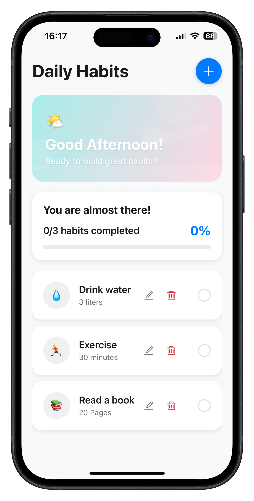
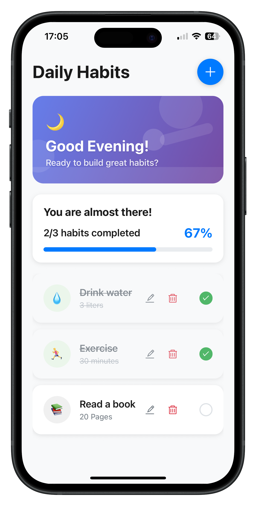

# React Native Habit Tracker App

> This project showcases a simple habit tracker built with React Native and Expo.


## Habit Tracker App





## Features

- See a list of all the habits
- Check the habits that have been completed
- See which habits are completed and which are not
- See an overview of my progress for the day: how many habits are done compared to the total number of habits (ex: 2/3 habits completed)
- Ability for the user to edit (add, remove, update) the daily habits
- Automatically reset the state of the habits when a new day starts
- Responsive and accessible design

## Getting Started

### Prerequisites

- [Node.js](https://nodejs.org/)
- [Expo CLI](https://docs.expo.dev/get-started/installation/)
- [Yarn](https://yarnpkg.com/) or [npm](https://www.npmjs.com/)

### Installation

1. **Clone the repository:**

   ```sh
   git clone https://github.com/thepembeweb/habit-tracker.git
   cd habit-tracker
   ```

2. **Install dependencies:**

   ```sh
   yarn install
   # or
   npm install
   ```

3. **Start the Expo development server:**

   ```sh
   expo start
   ```

4. **Run on your device or simulator:**
   - Scan the QR code with Expo Go (iOS/Android)
   - Or press `i` for iOS simulator, `a` for Android emulator

## Built With

- [React Native](https://reactnative.dev/) - The mobile framework used
- [Expo](https://expo.dev/) - The platform used to build the universal app
- [Tyescript](https://www.typescriptlang.org/) - The programming language used
- [Node](https://nodejs.org) - Javascript Runtime

## Authors

- **[Pemberai Sweto](https://github.com/thepembeweb)** - _Initial work_ - [Habit Tracker](https://github.com/thepembeweb/habit-tracker)
